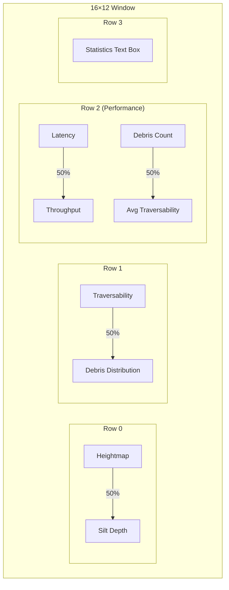

# 🌊 GangaMitra - River Terrain Simulation System

> **Real-time river terrain simulation and navigation analysis, powered by PyBullet, Pathway, and ZeroMQ**

[](https://www.python.org/downloads/)
[](LICENSE)
[](https://pybullet.org/)
[](https://zeromq.org/)
[](https://github.com)

**GangaMitra** is a real-time river terrain simulation and robotic navigation system designed for aquatic debris collection missions. The project simulates dynamic river environments with realistic terrain features, silt deposits, debris distribution, and flow fields, while providing a physics-based 3D visualization with a hexapod robot navigating the terrain.

---

## 📋 Table of Contents
- [Quick Start](#quick-start)
- [Overview](#overview)
- [Key Features](#key-features)
- [Screenshots & Demo](#screenshots--demo)
- [Architecture](#architecture)
- [Core Components](#core-components)
- [Installation](#installation)
- [Usage](#usage)
- [Technical Achievements & Evolution](#technical-achievements--evolution)
- [Docker Deployment](#docker-deployment)
- [Data Flow](#data-flow)
- [Configuration](#configuration)
- [Performance Benchmarks](#performance-benchmarks)
- [Best Practices](#best-practices)
- [Troubleshooting](#troubleshooting)
- [Failed Attempts & Lessons Learned](#failed-attempts--lessons-learned)
- [Design Decisions & Trade-offs](#design-decisions--trade-offs)
- [Future Enhancements](#future-enhancements)
- [Learning Resources](#learning-resources)
- [Contributing](#contributing)
- [Project Structure](#project-structure-summary)
- [System Requirements](#system-requirements)
- [License](#license)
- [Acknowledgments](#acknowledgments)

---

## 🎯 Overview

GangaMitra is a comprehensive simulation pipeline that:
- **Generates** realistic river terrain with procedural heightmaps, silt deposits, and debris
- **Processes** terrain data using Pathway for real-time traversability analysis
- **Visualizes** the environment in 3D using PyBullet physics engine
- **Analyzes** slope, silt, and debris distribution for navigation planning
- **Monitors** system performance through real-time dashboards
- **Streams** data via ZeroMQ pub-sub architecture

The system uses **ZeroMQ** for high-performance inter-process communication and supports **Docker deployment** for the data processing pipeline.

### 🛠️ Technologies Used

**Core Technologies**:
- **[PyBullet](https://pybullet.org/)** - Physics simulation engine
- **[Pathway](https://pathway.com/)** - Real-time stream processing
- **[ZeroMQ](https://zeromq.org/)** - High-performance messaging
- **[Docker](https://www.docker.com/)** - Containerization

**Python Libraries**:
- **NumPy** - Numerical computing
- **Matplotlib** - 2D visualizations
- **Plotly** - Interactive charts
- **Pandas** - Data manipulation
- **Noise** - Perlin noise generation
- **psutil** - System monitoring

**Infrastructure**:
- **Docker Compose** - Multi-container orchestration
- **Git** - Version control
- **Conda/pip** - Package management

---

## ✨ Key Features

###  Realistic Terrain Simulation
- Procedural Perlin noise heightmap generation
- Dynamic river channel carving with sinusoidal paths
- Silt deposit simulation along riverbanks
- 2D flow field generation for water dynamics
- Real-time terrain updates at 2 FPS

### 📊 Advanced Analytics
- Real-time traversability computation
- Slope and silt penalty analysis
- Debris tracking and classification
- Performance metrics and system health monitoring
- Multiple visualization modes (3D, 2D, heatmaps)

### 🔄 Stream Processing Pipeline
- Pathway-based real-time data processing
- Sub-5ms processing latency
- Dual-channel publishing (data + metrics)
- Dockerized deployment support

---

## � Screenshots & Demo

### Matplotlib Performance Dashboard
Comprehensive monitoring dashboard with terrain analysis:

[View Demo Video](https://github.com/user-attachments/assets/52453bae-d01f-4ecf-a4ae-1ce926cec2b4)

*Multi-panel dashboard displaying heightmaps, silt depth, traversability, debris distribution, and performance metrics*

### PyBullet 3D Visualization
Real-time physics-based terrain rendering:


*3D heightfield terrain with dynamic updates*

### Pathway Pipeline Processing
Docker-based stream processing in action:


*Pathway pipeline processing terrain data with sub-5ms latency*

### Data Flow Visualization
Complete system integration:


*ZeroMQ-based pub-sub architecture connecting all components*

---

## 🏗️ Architecture

```
┌─────────────────┐         
│   generator.py  │  Generates procedural terrain, silt, debris, flow fields
│     (Python)    │  Publishes via ZeroMQ (port 5555)
└────────┬────────┘
         │
         ▼
┌─────────────────────────────┐
│  pathway_pipeline.py        │  Stream processing with Pathway
│  (Python/Docker Container)  │  - Computes traversability
│                             │  - Adds metadata
│                             │  Publishes to ports 5556 & 5557
└────────┬────────────────────┘
         │
         ├──────────────────────┬────────────────────┐
         ▼                      ▼                    ▼
┌─────────────────┐    ┌──────────────┐    ┌──────────────┐
│pybullet_terrain │    │ dashboard.py │    │visualizer.py │
│      .py        │    │  (Metrics)   │    │ (Basic 2D)   │
│  3D Physics     │    │              │    │              │
│  Rendering      │    │ Matplotlib   │    │ Matplotlib   │
└─────────────────┘    └──────────────┘    └──────────────┘
```

### Data Flow
1. **Generator** creates realistic river terrain frames at 2 FPS
2. **Pathway Pipeline** processes each frame, computing traversability scores
3. **PyBullet Viewer** renders 3D terrain in real-time
4. **Dashboard** displays real-time metrics and performance
5. **Visualizer** provides simple 2D terrain preview
6. All components communicate via **ZeroMQ** pub-sub pattern

---

## 🔧 Core Components

### 1. **generator.py** - Terrain Generation Engine

**Purpose**: Procedurally generates realistic river terrain data with natural features.

**Features**:
- **Heightmap Generation**: Uses Perlin noise for realistic terrain elevation
- **River Channel Carving**: Sinusoidal river path with configurable width and depth
- **Silt Deposit Simulation**: Gaussian distribution along riverbanks
- **Debris Placement**: Random debris items (bottles, idols, cloth, metal) with physics properties
- **Flow Field Generation**: 2D velocity field for water flow simulation
- **ZeroMQ Publishing**: Streams data at 2 FPS on port 5555


**Key Parameters**:
```python
GRID_SIZE = 64          # 64x64 grid
CELL_SIZE = 0.5         # 0.5m per cell (32m x 32m total)
PUB_FREQ = 2           # 2 frames per second
```

**Output Data Structure**:
```json
{
  "sequence_id": 123,
  "timestamp": 1234567.89,
  "terrain": {
    "heightmap": [4096 floats],     // 64x64 grid flattened
    "silt_depth": [4096 floats],    // Silt accumulation
    "flow_u": [4096 floats],        // X-velocity component
    "flow_v": [4096 floats]         // Y-velocity component
  },
  "debris": [
    {"x": 12.5, "y": 8.3, "type": "bottle", "size": 0.2, "buoyant": true, "tangle_risk": false},
    ...
  ],
  "metadata": {
    "grid_size": 64,
    "cell_size": 0.5
  }
}
```

---

### 2. **pathway_pipeline.py** - Stream Processing Engine

**Purpose**: Real-time data processing using Pathway framework for traversability analysis.

**Features**:
- **Traversability Computation**: Combines slope and silt penalties
  - Slope penalty: `tanh(slope_magnitude * 2)`
  - Silt penalty: `clip(silt / 0.5, 0, 1)`
  - Combined: `1.0 - (0.4 * slope + 0.6 * silt)`
- **Metadata Enhancement**: Adds processing timestamps and statistics
- **Dual Publishing**:
  - Port 5556: Full data for simulators
  - Port 5557: Metrics for dashboard
- **Docker Support**: Runs in container with host network access


**Environment Variables**:
```bash
GENERATOR_HOST=host.docker.internal  # Generator location
GENERATOR_PORT=5555                  # Input port
OUTPUT_PORT=5556                     # Simulator output
DASHBOARD_PORT=5557                  # Dashboard output
```

**Performance Metrics**:
- Processing latency: ~1-5ms per frame
- Throughput: 2 FPS (limited by generator)
- Memory: ~50MB per container

---

### 3. **pybullet_terrain.py** - 3D Physics Visualization

**Purpose**: Real-time 3D terrain visualization using PyBullet physics engine.

**Features**:
- **Heightfield Terrain**: Dynamic terrain loading from ZMQ stream
- **Physics Engine**: PyBullet with gravity (-9.81 m/s²)
- **Visual Features**:
  - Sandy brown terrain color
  - Reference coordinate axes
  - Real-time frame counter
  - Camera positioned at 25m distance, 45° yaw, -30° pitch
- **Update Rate**: Smooth terrain updates synchronized with generator
- **Terrain Parameters**:
  - Grid: 64×64 cells
  - Cell size: 0.5m
  - Height scale: 2.0m
  - Total area: 32m × 32m

**Controls**:
- PyBullet GUI provides interactive camera control
- Mouse drag to rotate view
- Mouse wheel to zoom
- Terrain updates automatically from Pathway pipeline

**Technical Implementation**:
```python
# Heightfield creation
terrain_shape = p.createCollisionShape(
    p.GEOM_HEIGHTFIELD,
    meshScale=[cell_size, cell_size, height_scale],
    heightfieldData=heightmap_data,
    numHeightfieldRows=grid_size,
    numHeightfieldColumns=grid_size
)

# Non-blocking ZMQ updates
socket.RCVTIMEO = 100  # 100ms timeout
while True:
    msg
```
---

### 5. **dashboard.py** - Performance Monitoring

**Purpose**: Real-time visualization of system metrics and terrain analysis.

**Dashboard Layout** (16×12 window):

---
**Metrics Displayed**:
1. **Terrain Visualizations**:
   - Heightmap (terrain colormap, 0-2m)
   - Silt depth (YlOrBr colormap, 0-0.5m)
   - Traversability map (RdYlGn, 0-1 score)
   - Debris scatter plot (color-coded by type)

2. **Performance Graphs**:
   - Processing latency (ms)
   - Throughput (FPS)
   - Debris count over time
   - Average traversability over time

3. **Statistics**:
   - Current frame number
   - Frames processed
   - Processing time
   - Silt statistics (min/max/avg)
   - Traversability statistics

**Update Rate**: 10 FPS (100ms animation interval)


https://github.com/user-attachments/assets/52453bae-d01f-4ecf-a4ae-1ce926cec2b4


---

### 6. **visualizer.py** - Simple 2D Viewer

**Purpose**: Lightweight matplotlib-based 2D visualization.

**Features**:
- Two-panel layout: Heightmap + Silt Depth
- Debris overlay with color coding:
  - 🟢 Green: Bottles (buoyant)
  - 🟡 Gold: Idols (heavy)
  - 🔴 Red: Cloth (tangle risk)
  - ⚫ Gray: Metal
- Non-blocking updates for smooth animation
- Useful for quick debugging without 3D overhead

---

### 7. **subscriber.py** - Debug Tool

**Purpose**: Simple terminal-based data stream monitor.

**Output**:

Seq 142, time 1234.567
  heightmap shape: 4096 values
  silt_depth shape: 4096 values
  flow fields present: True
  debris count: 8
    {'x': 12.5, 'y': 8.3, 'type': 'bottle', ...}
    {'x': 4.2, 'y': 19.1, 'type': 'idol', ...}
    {'x': 28.7, 'y': 15.4, 'type': 'cloth', ...}
----------------------------------------
```

---

## 💾 Installation

### Prerequisites
- **Python 3.10+**
- **Conda** or **virtualenv** (recommended)
- **Docker** (optional, for Pathway pipeline)

### Step 1: Clone Repository
```bash
git clone <repository-url>
cd GangaMitra
```

### Step 2: Install Python Dependencies
```bash
# Create virtual environment (recommended)
conda create -n gangamitra python=3.10
conda activate gangamitra

### Step 2: Install Python Dependencies

```bash
# Install core dependencies
pip install pybullet numpy pyzmq noise matplotlib pathway
```

**Core Dependencies**:
- `pybullet` - Physics simulation engine
- `numpy` - Numerical computing
- `pyzmq` - ZeroMQ messaging
- `noise` - Perlin noise generation for terrain
- `matplotlib` - 2D visualizations and dashboards
- `pathway` - Stream processing framework

### Step 3: Verify Installation
```bash
# Verify all dependencies
python -c "import pybullet, zmq, numpy, noise, matplotlib, pathway; print('✅ All components OK')"
```

---

## 🚀 Usage

### Running the Complete Pipeline

**Terminal 1: Start Generator**
```bash
python generator.py
```
Output:
```
Generator started. Publishing terrain data on port 5555
Publishing at 2.0 FPS
🌊 Published frame 1 at 1234567.89
```

**Terminal 2: Start Pathway Pipeline**
```bash
python pathway_pipeline.py
```
Output:
```
🚀 Pathway pipeline is running!
📦 Frame 1 received
  ⚙️  Traversability computed in 2.3ms
```

**Terminal 3: Start 3D Visualizer**
```bash
python pybullet_terrain.py
```
- PyBullet GUI window opens
- Terrain updates in real-time
- Interactive camera controls

**Terminal 4 (Optional): Start Dashboard**
```bash
python dashboard.py
```
- Matplotlib dashboard opens
- Real-time metrics and visualizations

### Alternative: Simple Viewers

**2D Visualizer**:
```bash
python visualizer.py
```

**Debug Subscriber** (verify data stream):
```bash
python subscriber.py
```

**Terrain-Only 3D View**:
```bash
python pybullet_terrain.py
```

---

## 🐳 Docker Deployment

The Pathway pipeline can run in Docker for isolated deployment.

### Build Docker Image
```bash
docker-compose build
```

### Run Pipeline Container
```bash
docker-compose up
```

**What happens**:
1. Pathway container starts
2. Connects to generator on Windows host via `host.docker.internal`
3. Binds ports 5556 and 5557 for output
4. Processes terrain data continuously


### Configuration Files

**docker-compose.yml**:
```yaml
services:
  pathway:
    build:
      context: .
      dockerfile: Dockerfile.pathway
    ports:
      - "5556:5556"  # Simulator output
      - "5557:5557"  # Dashboard output
    environment:
      - GENERATOR_HOST=host.docker.internal
      - GENERATOR_PORT=5555
    extra_hosts:
      - "host.docker.internal:host-gateway"  # Windows compatibility
```

**Dockerfile.pathway**:
```dockerfile
FROM python:3.10-slim
WORKDIR /app
COPY requirements_pathway.txt .
RUN pip install --no-cache-dir -r requirements_pathway.txt
COPY pathway_pipeline.py .
CMD ["python", "pathway_pipeline.py"]
```

**requirements_pathway.txt**:
```
pathway
numpy
pyzmq
```

### Stop Container
```bash
docker-compose down
```

---

## 📡 Data Flow

### Port Mapping
| Port | Source | Destination | Data |
|------|--------|-------------|------|
| 5555 | generator.py | pathway_pipeline.py | Raw terrain data |
| 5556 | pathway_pipeline.py | pybullet_*.py, visualizer.py | Processed data + traversability |
| 5557 | pathway_pipeline.py | dashboard.py | Metrics only |

### Message Flow Diagram
```
generator.py (5555) → pathway_pipeline.py
                              ↓
                    ┌─────────┴─────────┐
                    ▼                   ▼
          (5556) Simulators      (5557) Dashboard
                    │
            ┌───────┼───────┐
            ▼       ▼       ▼
    pybullet_  visualizer subscriber
    terrain.py    .py        .py
```


---

## ⚙️ Configuration

### Generator Parameters (generator.py)
```python
GRID_SIZE = 64          # Grid resolution (64×64)
CELL_SIZE = 0.5         # Meters per cell
PUB_FREQ = 2           # Publishing frequency (Hz)
ZMQ_PORT = 5555        # Output port

# Terrain generation
scale = 10.0           # Perlin noise scale
octaves = 6            # Noise detail level
river_width = 5        # River width in cells
river_depth = 0.8      # River depth (meters)

# Debris
num_items = 5-15       # Random debris count per frame
types = ["bottle", "idol", "cloth", "metal"]
```

### Pathway Pipeline (pathway_pipeline.py)
```python
# Traversability weights
slope_weight = 0.4
silt_weight = 0.6

# Slope penalty function
slope_penalty = tanh(slope_magnitude * 2)

# Silt penalty threshold
silt_threshold = 0.5  # meters
```

### PyBullet Simulator (pybullet_terrain.py)
```python
# Terrain
grid_size = 64
cell_size = 0.5
terrain_height_scale = 2.0
start_pos = [16, 16, 1.5]  # Center of terrain
body_mass = 2.0            # kg
leg_mass = 0.3             # kg
body_size = [0.2, 0.12, 0.08]  # meters

# Camera
cameraDistance = 25
cameraYaw = 45
cameraPitch = -30
```

---

## ❌ Failed Attempts & Lessons Learned

The `useless trials/` folder contains experimental code that didn't make it into the final system. These attempts provided valuable learning experiences:

### 1. **MuJoCo-Based Simulators** ❌

**Files**: 
- `simulator.py`
- `interactive_terrain.py`
- `working_world_model.py`
- `minimal_terrain.xml`, `playground.xml`, test configuration XMLs

**Attempted Features**:
- MuJoCo physics engine integration
- Complex heightfield terrain
- Interactive object manipulation
- Multi-threaded terrain updates

**Why It Failed**:
- **License Issues**: MuJoCo licensing was complex
- **Heightfield Limitations**: MuJoCo's heightfield had rendering issues with dynamic updates
- **Threading Complexity**: Race conditions in terrain updates
- **Performance**: Slower than expected for real-time updates
- **XML Configuration**: Tedious manual XML editing for robot models

**Lesson Learned**: 
> *"PyBullet's simpler API and better heightfield support made it a better fit for rapid prototyping. Sometimes, simpler is better."*

---

### 2. **Alternative Physics Simulators** ❌

#### test_gym.py - Gymnasium/MuJoCo
```python
# Attempted to use pre-built Gym environments
env = gym.make('HalfCheetah-v4', render_mode='human')
```
**Issue**: Pre-made environments don't support custom terrain
**Lesson**: Need custom simulation for custom requirements

#### test_pychrono.py - Project Chrono
```python
# Attempted PyChrono for accurate physics
system = chrono.ChSystemNSC()
motor.SetMotionFunction(chrono.ChFunction_Sine(0, 0.5, 2.0))
```
**Issues**:
- Installation extremely complex on Windows
- Irrlicht visualization dependency issues
- Overkill for our use case (designed for vehicle dynamics)
**Lesson**: Match tool complexity to problem complexity

#### test_pinnochio.py - Pinocchio
```python
# Attempted robotics-focused library
import pinocchio as pin
```
**Issue**: Pinocchio is for robot kinematics/dynamics, not terrain simulation
**Lesson**: Use the right tool for the job - Pinocchio excels at robot control, not environmental simulation

#### test_taichi.py - Taichi Lang
```python
# Attempted GPU-accelerated physics
ti.init(arch=ti.gpu)
@ti.kernel
def update_wave(t: ti.f32):
    ...
```
**Issues**:
- GPU programming complexity
- Integration with other components difficult
- Debugging harder than CPU code
**Lesson**: GPU acceleration premature optimization for this scale

---

### 3. **Simple PyBullet Tests** ✅ (Led to Success)

**File**: `test_pybullet.py`

**What Worked**:
```python
# Simple heightfield creation
terrain_shape = p.createCollisionShape(
    p.GEOM_HEIGHTFIELD,
    heightfieldData=heightfield_data
)
```

**Why It Succeeded**:
- ✅ Easy heightfield API
- ✅ Simple installation (`pip install pybullet`)
- ✅ Built-in GUI viewer
- ✅ Good documentation
- ✅ Fast enough for real-time updates

**Lesson**: 
> *"The simple test became the foundation for the final system. Start simple, iterate fast."*


---

### 4. **Wave Animation Experiments** 🔄

**Files**: 
- `wave_test.py`, `wave_test.xml`
- `debug_wave.xml`

**Purpose**: Test dynamic terrain updates with wave patterns

**What We Learned**:
- Smooth terrain updates require proper synchronization
- Visual feedback crucial for debugging terrain generation
- Mathematical wave functions translate well to river simulation
- These experiments led to the flow field implementation

---

### 5. **Simple Playground Experiments** ✅

**Files**:
- `simple_playground.py`
- `playground.xml`
- `mock_simulator.py`

**Purpose**: Minimal environments for testing basic concepts

**Value**:
- Validated ZMQ communication patterns
- Tested terrain update frequencies
- Established performance baselines
- Proved real-time updates were feasible

**Lesson**: 
> *"Build the minimal viable version first. Complexity can always be added later."*

---

### 6. **World Model Experiments** 🔄

**File**: `test_world_model.py`, `working_world_model.py`

**Concept**: Separate "world state" from "visualization"

**Attempted Architecture**:
```
Generator → World Model → Renderer
                ↓
         (Maintains State)
```

**Why It Was Too Complex**:
- Added unnecessary abstraction layer
- State management overhead
- Harder to debug
- Direct streaming proved simpler and faster

**Lesson**: 
> *"YAGNI (You Aren't Gonna Need It) - Don't over-engineer. The simplest architecture that works is usually best."*

---

### Key Takeaways from Failed Attempts

| Attempt | Technology | Main Issue | What We Learned |
|---------|-----------|------------|-----------------|
| MuJoCo Simulator | MuJoCo | Complex setup, heightfield issues | Simple tools win |
| Gym Integration | Gymnasium | Pre-built envs too rigid | Custom needs → custom code |
| PyChrono | Project Chrono | Installation nightmare | Match tool to problem |
| Pinocchio | Pinocchio | Wrong use case | Know your libraries |
| Taichi GPU | Taichi Lang | Premature optimization | CPU often fast enough |
| PyBullet Test | PyBullet | ✅ WORKED! | Start simple, iterate |
| World Model | Custom | Over-engineering | Keep it simple |

---

## 🎓 Design Decisions & Trade-offs

### Why PyBullet?
- ✅ Easy installation and setup
- ✅ Excellent heightfield terrain support
- ✅ Built-in GUI for visualization
- ✅ Good enough physics for navigation tasks
- ✅ Active community and documentation

### Why ZeroMQ?
- ✅ High performance (microsecond latency)
- ✅ Multiple transport protocols
- ✅ Pub-Sub pattern perfect for streaming
- ✅ Language agnostic (future C++/Rust integration)
- ✅ No broker needed (simpler than RabbitMQ/Kafka)

### Why Pathway?
- ✅ Python-native stream processing
- ✅ Easy DataFrame-like API
- ✅ Good for real-time transformations
- ✅ Horizontal scaling potential
- ❌ (Trade-off) Smaller community than Kafka

### Why Not Real-Time Physics?
- Current: 2 FPS terrain generation
- Reason: Focus on terrain analysis, not robot control
- Future: Can scale to higher frequencies if needed

---


## 📊 Performance Benchmarks

**Test System**: Windows 11, AMD Ryzen 9HX, 8GB RAM, GTX 5050

| Component | CPU Usage | Memory | FPS/Latency |
|-----------|-----------|--------|-------------|
| generator.py | ~5% | 50 MB | 2 FPS |
| pathway_pipeline.py | ~10% | 80 MB | <5ms latency |
| pybullet_hexapod.py | ~20% | 200 MB | 100 Hz physics |
| dashboard.py | ~15% | 150 MB | 10 FPS render |
| **Total System** | ~50% | ~480 MB | Stable |

---

## Made with 💌 by AstroIshu
